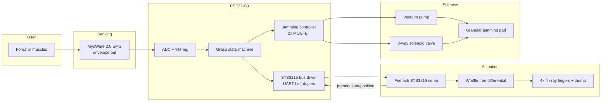

# System Architecture — Flexible Prosthetic Hand

## 1. System overview



Three layers of compliance, each handling a different timescale:

| Layer | Mechanism | Timescale | Controlled by |
|---|---|---|---|
| Passive | Fin-ray wrap + silicone pads | instant | geometry (no control) |
| Grasp | Whiffle-tree tendon differential | ~0.5 s | servo position + load |
| Stiffness | Granular jamming pad | ~1–2 s | pump + valve |

Design rule: intelligence lives as low in the stack as possible. The fingers
conform with zero computation; the servo only decides *how much* to close;
firmware only decides *when* to stiffen.

## 2. Mechanical architecture

```
[STS3215 servo] -- horn --> [primary rocker 50mm]
                              /              \
              [secondary rocker 40mm]   [secondary rocker 40mm]
                 /        \                /         \
             [index]   [middle]        [ring]     [pinky]
```

- Each rocker pivots freely at its midpoint: when one finger contacts an
  object, its tendon stops moving and the rocker rotates, routing the
  remaining travel to the sibling finger. Four fingers self-balance with
  zero sensors.
- Thumb: fixed opposed position in v1 (printed at 45° opposition). v2 option:
  a Feetech SCS0009 micro bus servo on the same UART bus for abduction.
- Tendon run: servo horn → primary rocker → secondary rocker → PTFE tube
  through palm → fin-ray back-wall channel → figure-8 stopper knot at tip
  anchor. Return force: fin-ray elasticity itself (no extensor tendon in v1).
- Tensioning: each rocker end hole is a slot with an M3 grub-screw clamp so
  UHMWPE creep can be taken up without re-knotting.

Key travel calculation: full finger flexion needs ~18 mm of tendon travel.
Servo horn radius 12 mm × 120° usable sweep = 25 mm at the primary bar —
margin of ~1.4×, absorbed by the differential.

## 3. Electrical architecture

| Net | Source | Consumers | Notes |
|---|---|---|---|
| VBAT 7.4–12 V | 2S Li-ion + BMS | STS3215, pump (via MOSFET) | Servo is happiest at 7.4–12 V |
| 5 V | Buck from VBAT | MyoWare shield, solenoid | MyoWare 2.0 accepts 3.3–5 V |
| 3.3 V | ESP32 devkit LDO | ESP32-S3, logic | |

### Pin map (ESP32-S3 DevKitC; see firmware/README.md)

| GPIO | Function | Direction |
|---|---|---|
| 17 | UART1 TX → STS3215 data (through 74HC126 or direct with 1k resistor trick) | out |
| 18 | UART1 RX ← STS3215 data | in |
| 4 | EMG envelope (ADC1_CH3) | in |
| 5 | Pump MOSFET gate | out |
| 6 | Solenoid valve MOSFET gate | out |
| 7 | Mode button (INPUT_PULLUP) | in |
| 15 | Status LED | out |

The STS3215 uses single-wire half-duplex TTL. Cheapest interface: tie TX to
the data line through a 1 kΩ resistor and connect RX directly — TX idles high
and the resistor lets the servo win the line when replying. A Waveshare bus
driver board (~$6) is the tidy alternative.

### Power budget (worst case)
| Load | Current |
|---|---|
| STS3215 stall @12 V | ~2.5 A (limit in firmware to 1.5 A equiv. load) |
| Vacuum pump | ~0.4 A |
| Solenoid | ~0.2 A |
| ESP32 + EMG | ~0.15 A |
| **Peak** | **~3.2 A** → 2S 18650 pack (≥5 A rated BMS) is sufficient |

## 4. Firmware architecture (`firmware/prosthetic_hand/`)

Single-core superloop at 100 Hz (no RTOS needed at this rate):

```
loop @100Hz:
  emg_sample()        # ADC read → 20-sample moving average → envelope
  intent = classify() # dual-threshold hysteresis (or serial command)
  fsm_step(intent)    # OPEN / CLOSING / HOLDING / RELEASING
  servo_update()      # goal position; stop closing when load > limit
  jamming_update()    # stiffen when HOLDING && load high; vent on release
  telemetry @10Hz     # CSV over USB serial for plotting / data collection
```

### Grasp state machine

| State | Entry condition | Servo behavior | Jamming |
|---|---|---|---|
| OPEN | release intent / boot | goal = open position | vented |
| CLOSING | close intent | ramp toward closed at fixed speed | vented |
| HOLDING | servo load > grip threshold, or full travel | hold position, duty-limit if hot | stiffen if load > jam threshold for >1 s |
| RELEASING | open intent | ramp to open | vent immediately (valve first, then pump off) |

Load-based grip: instead of position targets per object, the servo closes
until *present load* (register 60) crosses the grip threshold — the
mechanical differential + fin-rays have already shaped the grasp by then.
This is impedance-ish control with zero tactile sensors.

### EMG intent (v1: single channel)
- Calibration at boot: 3 s of rest → noise floor; user squeezes once → max.
- Close intent: envelope > 35 % of (max − floor), with 150 ms debounce.
- Open intent: quick double-pulse within 600 ms (co-contraction pattern),
  so a single sustained squeeze can't accidentally open the hand.
- v2 (`software/`): 3-class ML classifier (rest/close/open) on windowed
  features, exported thresholds or TFLite-Micro model.

## 5. Software architecture (`software/`)
- `emg_collect.py` — logs the firmware's 10 Hz telemetry CSV to labeled
  session files (`rest.csv`, `close.csv`, `open.csv`).
- `emg_train.py` — windows the data (200 ms, 50 % overlap), extracts
  MAV / RMS / waveform-length / zero-crossings, trains a RandomForest,
  reports confusion matrix, and prints firmware-ready threshold constants.
  TFLite-Micro export is the documented upgrade path.

## 6. Interfaces & contracts
- **Serial command protocol** (USB, 115200 baud, newline-terminated):
  `o` open, `c` close, `g<0-100>` grip effort, `j`/`v` jam/vent, `?` status.
  This is also the test interface for Phase 2 before EMG exists.
- **Telemetry CSV**: `millis,emg_raw,emg_env,state,servo_pos,servo_load,jammed`
- **CAD ↔ hardware contract**: all printed parts reference the parameter
  block at the top of each `.scad` file; tendon channel Ø2.5 mm, PTFE 2 mm OD,
  M3 fasteners throughout.

## 7. Failure-mode behavior
| Failure | Detection | Response |
|---|---|---|
| Servo over-load / stall | present load > 90 % for 2 s | back off 5°, duty-limit |
| EMG sensor unplugged | envelope pinned at rail | freeze state, LED blink, fall back to serial commands |
| Vacuum loss (membrane leak) | pump duty > 80 % sustained | disable jamming, notify via telemetry |
| Brown-out under stall | ESP32 brown-out detector | servo torque-off on reboot, hand stays passively compliant (fail-soft — a key advantage over rigid hands) |
